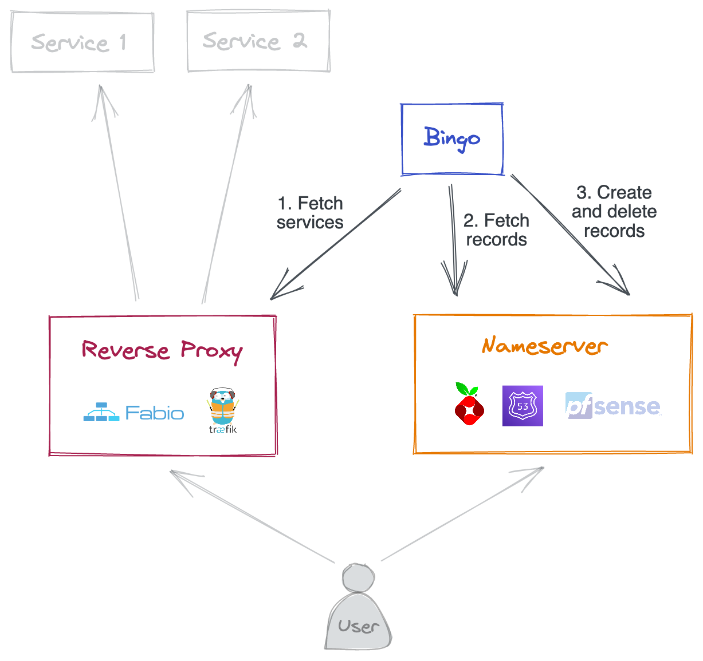

# Bingo

Bingo automates the creation of DNS records for services served by a reverse proxy.

The original idea (and currently only supported scenario) was to run alongside [Fabio](https://fabiolb.net/) ([hence](https://fabiolb.net/faq/why-fabio/) [the name](https://www.answers.com/movies-and-television/What_names_is_Nemo_called_by_Dory_in_Finding_Nemo)).

## Architecture



## Requirements

- A [supported nameserver](#nameservers)
- A [supported reverse proxy](#reverse-proxies)
- A "service parent domain" to register your service domains under.
  For example, with "svc.local" as a service parent domain, Bingo will:
  - Assume "ownership" of every subdomain of "svc.local" in the nameserver, meaning it will:
    - only ever create subdomains of "svc.local"
    - delete subdomains of "svc.local" it does not recognise
  - For a service named "myapp", create the subdomain "myapp.svc.local"
  - For a service named "home-assistant", create the subdomain "home-assistant.svc.local"
  - etc.

## Usage

### Docker CLI

```bash
docker run -d \
    -e FABIO_HOSTS="host1.local host2.local" \
    -e PIHOLE_URL=http://pihole.local:80 \
    -e PIHOLE_PASSWORD=abc123 \
    -e SERVICE_DOMAIN=svc.local \
    n6g7/bingo
```

### Docker Compose

```yaml
version: "3"

services:
  bingo:
    image: n6g7/bingo
    environment:
      FABIO_HOSTS: host1.local host2.local
      PIHOLE_URL: http://pihole.local:80
      PIHOLE_PASSWORD: "abc123"
      SERVICE_DOMAIN: svc.local
    restart: unless-stopped
```

### Nomad + Consul

```hcl
job "bingo" {
  datacenters = ["dc1"]
  type        = "service"

  group "bingo" {
    service {
      name = "bingo"
    }

    task "bingo" {
      driver = "docker"

      config {
        image = "n6g7/bingo"
      }

      template {
        destination = "secrets/bingo.env"
        env = true

        data = <<EOH
        FABIO_HOSTS="{{ range service "fabio" }}{{ .Node }}.local {{ end }}"
        PIHOLE_URL=http://pihole.local:80
        PIHOLE_PASSWORD="abc123"
        SERVICE_DOMAIN=svc.local
        EOH
      }

      resources {
        cpu    = 50
        memory = 32
      }
    }
  }
}

```

## Configuration

Bingo aims to require the least configuration possible, however we're not quite there yet.

All configuration is passed as environment variables.

### Minimum config for Fabio and Pi-hole

| Variable name     | Example                   | Description                                              |
| ----------------- | ------------------------- | -------------------------------------------------------- |
| `FABIO_HOSTS`     | `host1.local host2.local` | Hosts where Fabio is running.                            |
| `PIHOLE_URL`      | `http://pihole.local:80`  | Address of the Pi-hole instance.                         |
| `PIHOLE_PASSWORD` | `abc123`                  | Pi-hole admin password.                                  |
| `SERVICE_DOMAIN`  | `svc.local`               | Domain under which service subdomains should be created. |

### Complete config

| Variable name      | Default  | Description                                                                                                                                                                                                              |
| ------------------ | -------- | ------------------------------------------------------------------------------------------------------------------------------------------------------------------------------------------------------------------------ |
| `PROXY_TYPE`       | `fabio`  | The type of proxy to fetch services from. Currently only supports "fabio".                                                                                                                                               |
| `FABIO_HOSTS`      |          | List of space-separated hosts where Fabio is running.                                                                                                                                                                    |
| `FABIO_ADMIN_PORT` | `9998`   | Fabio's [admin UI port](https://fabiolb.net/ref/ui.addr/).                                                                                                                                                               |
| `FABIO_SCHEME`     | `http`   | URI scheme for Fabio                                                                                                                                                                                                     |
| `NAMESERVER_TYPE`  | `pihole` | The type of nameserver to managed records in. Currently only supports "pihole".                                                                                                                                          |
| `PIHOLE_URL`       |          | Address of the Pi-hole instance.                                                                                                                                                                                         |
| `PIHOLE_PASSWORD`  |          | Pi-hole admin password.                                                                                                                                                                                                  |
| `SERVICE_DOMAIN`   |          | Domain under which service subdomains should be created. Any service with a declared domain that does not match "\*.$SERVICE_DOMAIN" will be ignored. Bingo only ever creates or deletes subdomains of `SERVICE_DOMAIN`. |
| `LOG_LEVEL`        | `INFO`   | Logging verbosity. Supports "TRACE", "DEBUG", "INFO", "WARN", "ERROR" and "FATAL".                                                                                                                                       |

## Backends

### Reverse proxies

| Name                                  | Status                                                    |
| ------------------------------------- | --------------------------------------------------------- |
| [Fabio](https://fabiolb.net/)         | ✅ Supported                                              |
| [Træfik](https://traefik.io/traefik/) | ⏳ [Issue opened](https://github.com/n6g7/bingo/issues/9) |

### Nameservers

| Name                                        | Status                                                    |
| ------------------------------------------- | --------------------------------------------------------- |
| [Pi-hole](https://pi-hole.net/)             | ✅ Supported                                              |
| [Route 53](https://aws.amazon.com/route53/) | ⏳ [Issue opened](https://github.com/n6g7/bingo/issues/6) |
| [pfSense](https://www.pfsense.org/)         | ⏳ [Issue opened](https://github.com/n6g7/bingo/issues/8) |
